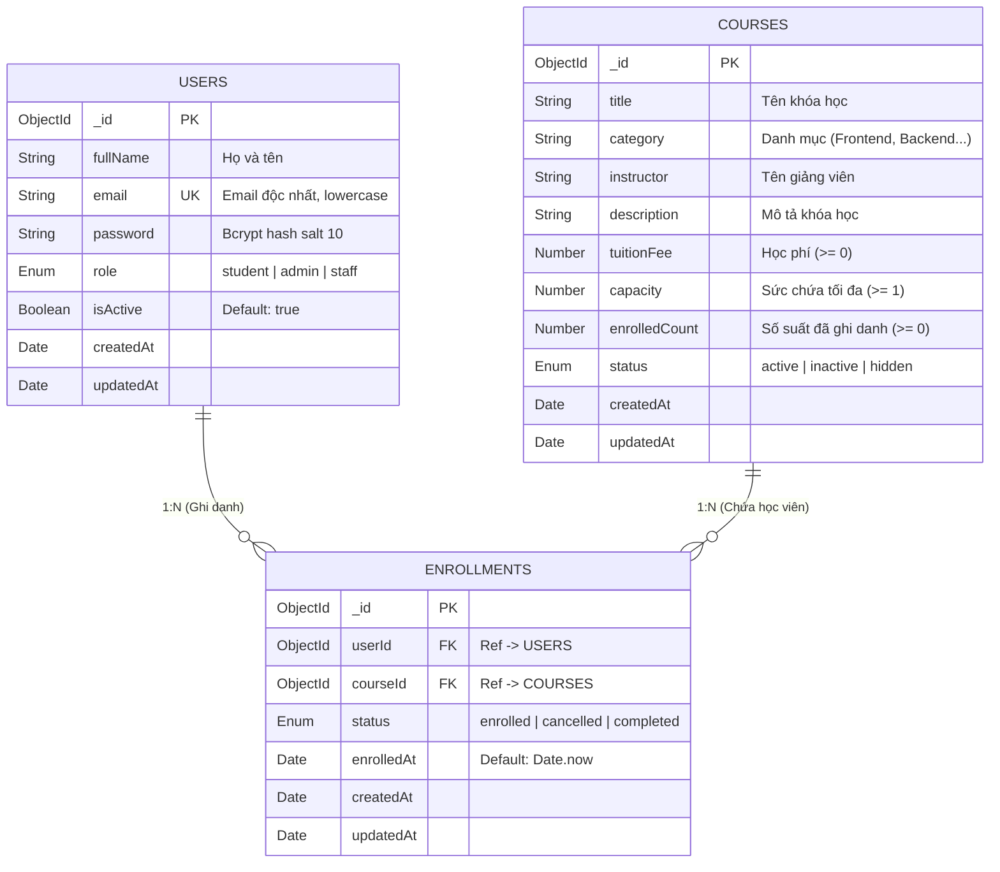

# 🗄️ THIẾT KẾ CƠ SỞ DỮ LIỆU (ERD) & CÁC RÀNG BUỘC (DATABASE CONSTRAINTS)

Dự án **PKS Course & Enrollment Portal** sử dụng cơ sở dữ liệu MongoDB quản lý thông qua Mongoose ORM với 3 collection chính: `users`, `courses`, và `enrollments`.

---

## 📊 Sơ đồ Quan hệ Thực thể (ERD Diagram)

---

## 🔒 Các Ràng buộc CSDL Quan trọng

| Thực thể | Ràng buộc / Index | Mô tả kỹ thuật |
|----------|-------------------|----------------|
| **Users** | `unique: true` trên `email` | Đảm bảo không tồn tại 2 tài khoản cùng email trong hệ thống |
| **Users** | `pre('save')` hook | Tự động mã hóa mật khẩu bằng `bcrypt` với `genSalt(10)` |
| **Users** | `toJSON` transform | Tự động xóa `password` và `__v` khi trả response JSON |
| **Courses** | Virtual `availableSlots` | Tự động tính toán `Math.max(0, capacity - enrolledCount)` |
| **Courses** | Virtual `isFull` | Tự động xác định trạng thái đã hết chỗ (`enrolledCount >= capacity`) |
| **Enrollments** | **Compound Unique Index** | `{ userId: 1, courseId: 1 }` với `{ unique: true }` → Chặn tuyệt đối ghi danh trùng ở tầng Database |
